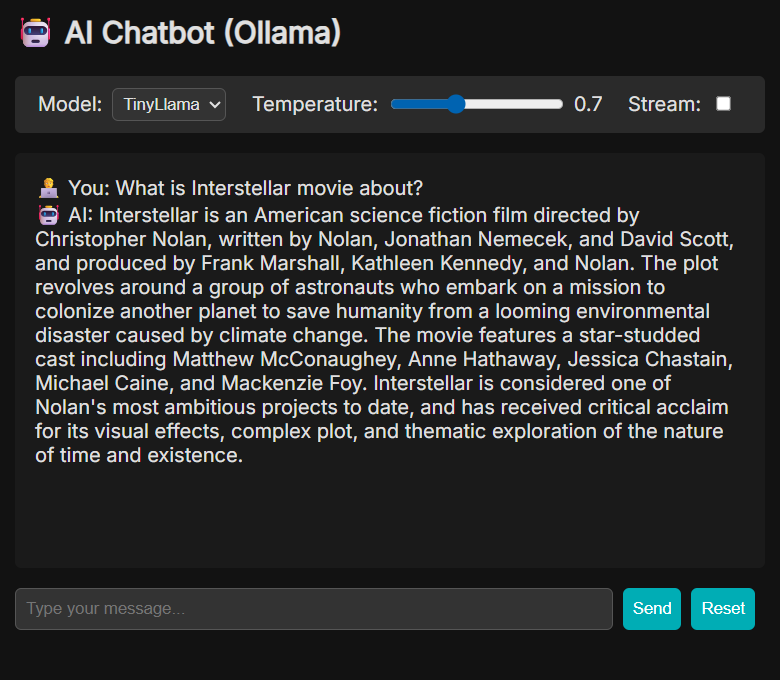

# Web UI Chatbot

A simple, intuitive web-based chat interface for interacting with local language models through the Ollama API. This project provides a lightweight FastAPI backend and a clean, responsive vanilla JavaScript frontend, making it an excellent starting point for building custom AI chat applications.



---

## Features

- **Real-time Interaction**: Supports both real-time streaming and standard non-streaming chat responses.
- **Configurable AI Parameters**: Easily configure the model, temperature, and streaming options directly from the web interface.
- **Persistent Chat History**: Conversations are automatically saved to a local `chatlog.json` file, maintaining state between sessions.
- **Clean & Modern UI**: A minimalist, dark-themed user interface built with vanilla HTML, CSS, and JavaScript.
- **Robust Backend**: Built with FastAPI, providing a high-performance, asynchronous API.
- **Comprehensive Test Suite**: Includes a full suite of unit tests written with `pytest` to ensure reliability.
- **Easy Setup**: Uses Poetry for dependency management, allowing for a quick and straightforward setup process.

## Tech Stack

- **Backend**: Python 3.13+, FastAPI, Uvicorn, httpx
- **Frontend**: HTML5, CSS3, Vanilla JavaScript
- **LLM Service**: [Ollama](https://ollama.ai/)
- **Dependency Management**: [Poetry](https://python-poetry.org/)
- **Testing**: pytest, pytest-asyncio, pytest-mock

## Prerequisites

Before you begin, ensure you have the following installed:

1.  **Python** (version 3.13 or higher)
2.  **Poetry** (see [installation instructions](https://python-poetry.org/docs/#installation))
3.  **Ollama**: The application must be [installed and running](https://ollama.ai/download) on your local machine.
4.  **An Ollama Model**: You need to have at least one model pulled from the Ollama library. For example:
    ```bash
    ollama pull llama3
    ```

## Installation & Setup

Follow these steps to get the project running locally.

1.  **Clone the Repository**
    ```bash
    git clone https://github.com/your-username/your-repo-name.git
    cd your-repo-name
    ```

2.  **Install Dependencies**
    Use Poetry to install all the required Python packages from the `pyproject.toml` file.
    ```bash
    poetry install
    ```

3.  **Run the Application**
    Start the FastAPI server using Uvicorn. The `--reload` flag enables hot-reloading for development.
    ```bash
    poetry run uvicorn src.main:app --reload
    ```
    The application will be available at `http://127.0.0.1:8000`.

## Usage

1.  Open your web browser and navigate to `http://localhost:8000/frontend`.
2.  In the settings panel, you can:
    -   Select the Ollama model you wish to use.
    -   Adjust the temperature slider to control the AI's creativity.
    -   Enable or disable streaming responses with the "Stream" checkbox.
3.  Type your message in the input box and press "Send" to start chatting!

## Running Tests

This project includes a comprehensive suite of unit tests to ensure the API is working as expected. To run the tests, execute the following command from the project root:

```bash
poetry run pytest
```

## Project Structure

```
.
├── src/
│   ├── main.py             # FastAPI application, API endpoints, and business logic
│   └── frontend/
│       ├── index.html      # The main HTML file for the UI
│       └── script.js       # JavaScript for frontend logic and API communication
├── tests/
│   └── test_main.py        # Unit tests for the FastAPI application
├── pyproject.toml          # Project metadata and dependencies for Poetry
├── poetry.lock             # Exact versions of dependencies
└── README.md               # This file
```

## License

This project is licensed under the MIT License.
